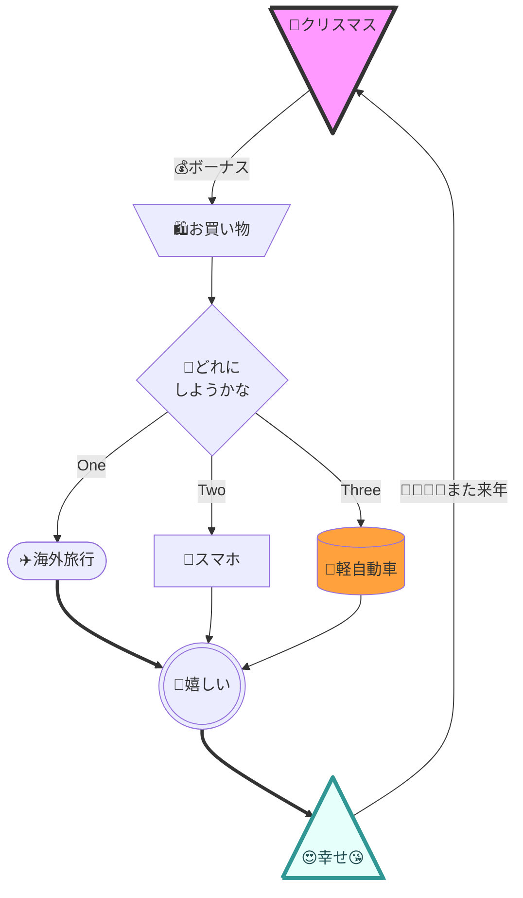

```mermaid
flowchart TD
    A[🎄クリスマス] -->|💰ボーナス| B[\🛍️お買い物/]
    B --> C
    C{🎅どれに<br>しようかな} -->|One| D
    C -->|Two| E
    C -->|Three| F
    D([✈️海外旅行]) ==> G
    E[📱スマホ] --> G
    F[(🚗軽自動車)]--> G(((🥰嬉しい)))
    G==>H[😍幸せ😘]
    H-->|👩‍❤️‍💋‍👨また来年|A

    %% スタイル定義
    style F fill:#ffa23e
    style A fill:#f9f,stroke:#333,stroke-width:4px
    style H fill:#e6fffa,stroke:#319795,stroke-width:4px,color:#234e52

    %% シェアイプ定義
    A@{ shape: manual-file}
    H@{ shape: tri}
```